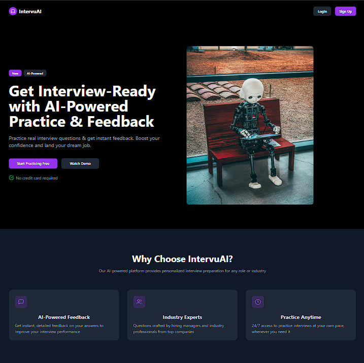
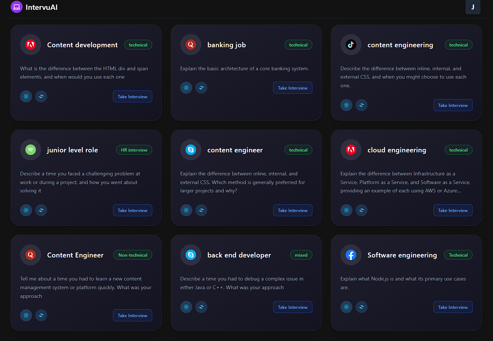
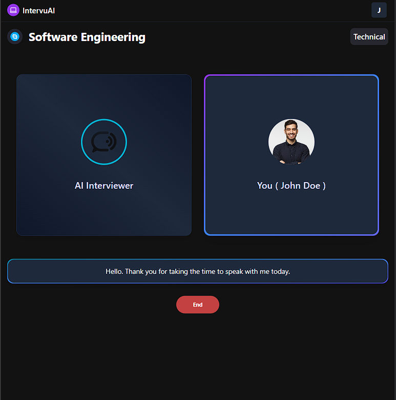

# IntervuAI 🎙️💼

**IntervuAI** is an AI-powered mock interview platform built using the **MERN stack**, **Vapi API**, and **Gemini API**. It simulates technical and non-technical interviews through dynamic interactions between the user and an AI interviewer.



---

## 🚀 Features

- 🤖 **AI Interviewer**: Simulates real-world interviews using Vapi voice AI and Gemini-based question generation.
- 📁 **Interview Modules**: Choose from various roles like Software Engineer, Content Developer, Backend Developer, etc.
- 🧠 **Smart Questioning**: Gemini API is used to generate intelligent and contextual questions.
- 🔊 **Voice Interaction**: Vapi API enables realistic voice-based interview simulations.
- 💡 **HR and Technical Rounds**: Supports both HR and technical interview scenarios.
- 📊 **Interview Feedback** (Coming Soon): Analyze performance and receive tips.

---

## 🛠 Tech Stack

- **Frontend**: React.js, Tailwind CSS
- **Backend**: Node.js, Express.js
- **Database**: MongoDB
- **APIs**:
  - **Vapi API**: For voice-based AI interviewer interaction.
  - **Gemini API (Google AI)**: For generating dynamic and role-specific questions.

---

## 📦 Installation and Setup

### 1. Clone the repository

```bash
git clone https://github.com/yourusername/intervuai.git
cd intervuai
```

### 2. Backend Setup

```bash
cd server
npm install
```

#### Create `.env` file in `/server` folder with:

```
MONGO_URI=your_mongo_connection_string
VAPI_API_KEY=your_vapi_api_key
GEMINI_API_KEY=your_gemini_api_key
PORT=5000
```

```bash
npm start
```

### 3. Frontend Setup

```bash
cd client
npm install
npm start
```

---

## 🧪 Usage

1. Select a role (e.g., Backend Developer, Content Engineer, etc.).
2. Click "Take Interview" to start the mock interview session.
3. Talk to the AI Interviewer using your microphone.
4. The interviewer asks questions using Gemini-generated content and Vapi's voice interaction.

---

## 📸 Screenshots

| Interview Dashboard | Interview Session |
|---------------------|------------------|
|  |  |

---

## Working Structure
https://app.eraser.io/workspace/kSBfnEmw1TN4fjKCGT0k?origin=share

## 🤝 Contributing

Pull requests are welcome. For major changes, please open an issue first to discuss what you would like to change.

---

## 📃 License

MIT License

---

## 📫 Contact

For queries or collaborations:

- **Surakanth Swamy**  
- 📧 surakanthswamy@example.com  
- 🌐 [LinkedIn](https://www.linkedin.com/in/surakanthswamy)
